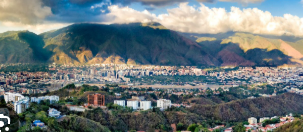

# Caracas

## Descripción
es una ciudad vibrante y llena de contrastes

## Recomendación
ubir al Parque Nacional El Ávila (Warairarepano) en teleférico

## Foto

## informacion de caracas
Caracas, fundada en 1567, es la capital y centro administrativo, financiero y cultural de Venezuela, situada en un valle al pie del Parque Nacional El Ávila. La ciudad ofrece una mezcla de historia colonial, como la Casa Natal del Libertador, y modernidad con altos rascacielos como las Torres del Parque Central.