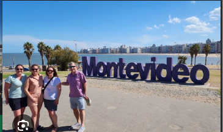

# Montevideo

## Descripción
capital y ciudad más poblada de la República Oriental del Uruguay
​
## Recomendación
visitar en verano (diciembre-marzo) por sus playas o en mayo por su otoño

## Foto

## Informacion sobre montevideo
es una vibrante ciudad portuaria a orillas del Río de la Plata, conocida por su alta calidad de vida, seguridad y su extensa rambla. Con aproximadamente 1.3 millones de habitantes, combina arquitectura histórica en la Ciudad Vieja con desarrollos modernos, ofreciendo una rica vida cultural, gastronomía y tranquilidad.